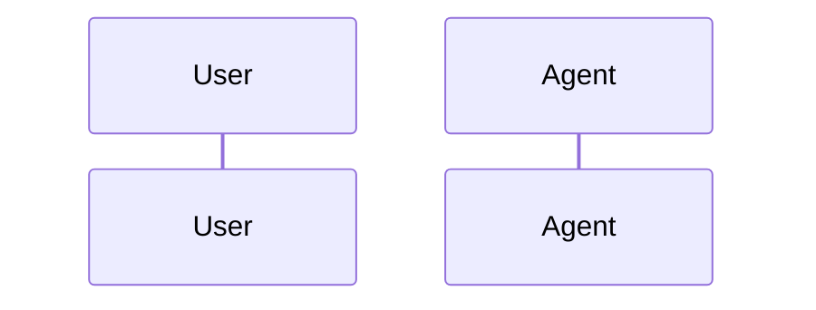

# Agent Scenario Report

Generated: 2026-05-13T22:24:58.058Z
API: http://localhost:3100/api/chat
Summary: 0/5 scenarios passed.

## Scenario Results

| Scenario | Status | Failures |
|---|---|---|
| full-e2e-green-haven | FAIL | 3 |
| full-e2e-stepup-mentorship | FAIL | 3 |
| impact-happy-path | FAIL | 4 |
| resources-list-capture | FAIL | 1 |
| resources-no-silent-drop | FAIL | 2 |

## full-e2e-green-haven

A high-clarity user providing detailed, structured data across all logic model sections.

Failures:
- turn 1: request failed: HTTP 500: <!DOCTYPE html><html><head><meta charSet="utf-8" data-next-head=""/><meta name="viewport" content="width=device-width" data-next-head=""/><noscript data-next-hide-fouc="true"></noscript><noscript data-n-css
- final: compiled_statement not captured
- final: outcomes.long_term missing or empty

Turn trace:

| Turn | finalIntent | stateIntent | responseDomain | effectiveDomain | patchSource | resourceBucketsInPatch | turnFailures |
|---|---|---|---|---|---|---:|---|

## full-e2e-stepup-mentorship

A user providing partial/vague info requiring agent follow-ups and coaching.

Failures:
- turn 1: request failed: HTTP 500: <!DOCTYPE html><html><head><meta charSet="utf-8" data-next-head=""/><meta name="viewport" content="width=device-width" data-next-head=""/><noscript data-next-hide-fouc="true"></noscript><noscript data-n-css
- final: resources.material missing or empty
- final: outcomes.short_term missing or empty

Turn trace:

| Turn | finalIntent | stateIntent | responseDomain | effectiveDomain | patchSource | resourceBucketsInPatch | turnFailures |
|---|---|---|---|---|---|---:|---|

## impact-happy-path

All-in-one impact statement is captured and confirmed.

Failures:
- turn 1: request failed: HTTP 500: <!DOCTYPE html><html><head><meta charSet="utf-8" data-next-head=""/><meta name="viewport" content="width=device-width" data-next-head=""/><noscript data-next-hide-fouc="true"></noscript><noscript data-n-css
- final: population not captured
- final: geography not captured
- final: long_term_goal not captured

Turn trace:

| Turn | finalIntent | stateIntent | responseDomain | effectiveDomain | patchSource | resourceBucketsInPatch | turnFailures |
|---|---|---|---|---|---|---:|---|

## resources-list-capture

When user provides a resource list, the patch captures multiple resource buckets.

Failures:
- turn 1: request failed: HTTP 500: <!DOCTYPE html><html><head><meta charSet="utf-8" data-next-head=""/><meta name="viewport" content="width=device-width" data-next-head=""/><noscript data-next-hide-fouc="true"></noscript><noscript data-n-css

Turn trace:

| Turn | finalIntent | stateIntent | responseDomain | effectiveDomain | patchSource | resourceBucketsInPatch | turnFailures |
|---|---|---|---|---|---|---:|---|

## resources-no-silent-drop

Resource response should not be ignored across turns and should keep resources in model state.

Failures:
- turn 1: request failed: HTTP 500: <!DOCTYPE html><html><head><meta charSet="utf-8" data-next-head=""/><meta name="viewport" content="width=device-width" data-next-head=""/><noscript data-next-hide-fouc="true"></noscript><noscript data-n-css
- final: model retained only 0 resource buckets after multi-turn flow

Turn trace:

| Turn | finalIntent | stateIntent | responseDomain | effectiveDomain | patchSource | resourceBucketsInPatch | turnFailures |
|---|---|---|---|---|---|---:|---|

